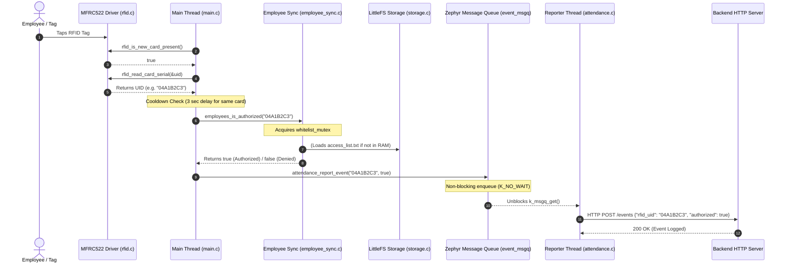

# ESP32 Zephyr RTOS WiFi RFID Access Control & Attendance System

An enterprise-grade, multi-threaded access control and attendance tracking system built on **Zephyr RTOS** for the **ESP32-DevKitC**. The system scans RFID cards/tags using an **MFRC522** reader over SPI, verifies UIDs locally in microsecond time against an in-RAM whitelist backed by a **LittleFS** flash filesystem, asynchronously posts scan logs to a central backend server, and periodically delta-syncs authorized personnel lists using server-controlled timestamps.

---

## Table of Contents
1. [Key Features](#key-features)
2. [Hardware Pinout & Device Wiring](#hardware-pinout--device-wiring)
3. [System Architecture & Diagrams](#system-architecture--diagrams)
4. [Multi-Threading & Kernel Primitives Breakdown](#multi-threading--kernel-primitives-breakdown)
   - [`event_msgq` (Asynchronous Event Queue)](#1-event_msgq-asynchronous-event-queue)
   - [`whitelist_mutex` (Thread Safety Mutex)](#2-whitelist_mutex-thread-safety-mutex)
   - [`ip_obtained_sem` (DHCP Synchronization Semaphore)](#3-ip_obtained_sem-dhcp-synchronization-semaphore)
   - [In-RAM Whitelist & LittleFS Truncation](#4-in-ram-whitelist--littlefs-truncation)
   - [Timestamp Delta Sync ("Method 6")](#5-timestamp-delta-sync-method-6)
   - [Card Cooldown & Debounce Logic](#6-card-cooldown--debounce-logic)
5. [Flash Filesystem Layout](#flash-filesystem-layout)
6. [Backend API Contracts](#backend-api-contracts)
7. [Source Code Map](#source-code-map)
8. [Configuration & Build Guide](#configuration--build-guide)

---

## Key Features

- ⚡ **Instant Microsecond Local Authorization**: Evaluates scanned card UIDs instantly against an in-RAM whitelist mirror (`whitelist[200][24]`).
- 🛡️ **Fail-Safe Offline Mode**: Persists the authorized employee list to LittleFS on flash memory (`/storage/access_list.txt`). The system continues granting/denying access even during network or power outages.
- 🔄 **Server-Driven Delta Synchronization**: Periodically queries `GET /employees?last_sync=<timestamp>`. Downloads only UIDs added or removed since the last sync cursor, keeping network bandwidth minimal.
- 🚀 **Non-Blocking Asynchronous Reporting**: Uses a Zephyr Message Queue (`event_msgq`) to send scan events (`POST /events`) via a dedicated background thread. Network lag or server downtime will **never** stall card scanning.
- 🔒 **Race-Condition Free Threading**: Synchronizes shared RAM/Flash structures using Zephyr Mutexes (`whitelist_mutex`) and Semaphores (`ip_obtained_sem`).
- 📡 **Socket-Level Network Safety**: Uses POSIX sockets with `SO_RCVTIMEO` set to 10 seconds to prevent broken network connections from hanging execution.

---

## Hardware Pinout & Device Wiring

The project targets the **ESP32-DevKitC** (`esp32_devkitc_procpu`) connected to an **MFRC522 RFID Module** over SPI2 (`spi2`):

| MFRC522 Pin | ESP32 GPIO Pin | Description / Devicetree Node |
| :--- | :--- | :--- |
| **SCLK** | `GPIO 18` | SPI Clock (`SPIM2_SCLK`) |
| **MISO** | `GPIO 19` | SPI Master-In Slave-Out (`SPIM2_MISO`) |
| **MOSI** | `GPIO 23` | SPI Master-Out Slave-In (`SPIM2_MOSI`) |
| **SDA / CS** | `GPIO 5` | SPI Chip Select (`cs-gpios`, Active Low) |
| **RST** | `GPIO 21` | Hardware Reset Pin (`rfid-reset-gpios`, Active Low) |
| **3.3V** | `3.3V` | Main Power Supply (Do NOT use 5V) |
| **GND** | `GND` | Ground |

*(Configured in [boards/esp32_devkitc_procpu.overlay](file:///home/yacine/Pictures/ESP32_Devkitc_Wifi_App/boards/esp32_devkitc_procpu.overlay))*

---

## System Architecture & Diagrams

### 1. High-Level Architecture

```mermaid
graph TB
    subgraph Hardware ["Hardware Layer (ESP32 DevKitC)"]
        MCU["ESP32 Microcontroller"]
        MFRC522["MFRC522 RFID Reader<br/>(SPI2: GPIO18, 19, 23, CS: GPIO5, RST: GPIO21)"]
        Flash["NVS Flash Memory<br/>(LittleFS Partition)"]
    end

    subgraph OS ["Zephyr RTOS Core"]
        SPI_Driver["SPI & GPIO Drivers"]
        LFS["LittleFS Filesystem (/storage)"]
        NetStack["Zephyr Network Stack (IPv4, DHCP, WiFi L2)"]
    end

    subgraph Software ["Application Firmware (C / Zephyr RTOS)"]
        MainThread["Main Loop / RFID Polling Thread<br/>(src/main.c)"]
        SyncThread["Periodic Employee Sync Thread<br/>(src/employee_sync.c)"]
        ReportThread["Attendance Reporting Thread<br/>(src/attendance.c)"]
        
        Mutex["whitelist_mutex"]
        MsgQ["event_msgq (Depth: 16)"]
        
        HTTP["POSIX Socket HTTP Client<br/>(src/http_client.c)"]
        WiFi["WiFi & Network Mgmt<br/>(src/wifi.c)"]
        Storage["Storage API<br/>(src/storage.c)"]
        RFID["MFRC522 Driver API<br/>(src/rfid.c)"]
    end

    subgraph Server ["Backend Cloud / LAN Server"]
        BackendServer["Central Server<br/>(192.168.1.246:8000)"]
        SyncAPI["GET /employees?last_sync=..."]
        ReportAPI["POST /events"]
    end

    %% Hardware to OS
    MFRC522 <==>|SPI2 / GPIO| SPI_Driver
    Flash <==> LFS
    MCU --> NetStack

    %% OS to Software
    SPI_Driver <--> RFID
    LFS <--> Storage
    NetStack <--> WiFi
    NetStack <--> HTTP

    %% Software Inter-Thread Sync
    MainThread -->|Reads Card UID| RFID
    MainThread -->|1. Check Whitelist| Mutex
    MainThread -->|2. Enqueue Event (Non-blocking)| MsgQ
    ReportThread -->|Dequeue Event| MsgQ
    SyncThread -->|Update Whitelist & Cursor| Mutex

    %% Network Connections
    HTTP -->|JSON POST| ReportAPI
    HTTP -->|JSON GET| SyncAPI
    SyncAPI --> BackendServer
    ReportAPI --> BackendServer
```

---

### 2. Card Scan & Attendance Reporting Sequence



---

## Multi-Threading & Kernel Primitives Breakdown

### 1. `event_msgq` (Asynchronous Event Queue)
- **File & Location**: [src/attendance.c: L24](file:///home/yacine/Pictures/ESP32_Devkitc_Wifi_App/src/attendance.c#L24)
- **Definition**:
  ```c
  K_MSGQ_DEFINE(event_msgq, sizeof(struct attendance_event), 16, 4);
  ```
- **Purpose**: Decouples the fast card-scanning main loop from slow HTTP POST requests over WiFi.
- **Mechanism**:
  - Main thread calls `attendance_report_event()`, executing `k_msgq_put(&event_msgq, &evt, K_NO_WAIT)`. `K_NO_WAIT` takes sub-microseconds; if the queue is full (network failure), the event is dropped instantly rather than stalling card scans.
  - The dedicated background thread (`reporter_thread`) calls `k_msgq_get(&event_msgq, &evt, K_FOREVER)`. It sleeps with 0% CPU consumption until an event arrives, then posts it to `POST /events`.

---

### 2. `whitelist_mutex` (Thread Safety Mutex)
- **File & Location**: [src/employee_sync.c: L33](file:///home/yacine/Pictures/ESP32_Devkitc_Wifi_App/src/employee_sync.c#L33)
- **Definition**:
  ```c
  K_MUTEX_DEFINE(whitelist_mutex);
  ```
- **Purpose**: Prevents memory corruption and race conditions between the **Main Loop Thread** (which reads the RAM whitelist) and the **Periodic Sync Thread** (which updates the RAM whitelist from the server).
- **Mechanism**:
  - Both `employees_is_authorized()` (reader) and `employees_sync()` (writer) acquire `whitelist_mutex` before accessing or mutating `whitelist[200][24]`.
  - **Key Design Rule**: Network GET requests occur **OUTSIDE** the lock. The mutex is locked only for the brief microsecond window required to update RAM array entries and write `/storage/access_list.txt`.

---

### 3. `ip_obtained_sem` (DHCP Synchronization Semaphore)
- **File & Location**: [src/wifi.c: L13](file:///home/yacine/Pictures/ESP32_Devkitc_Wifi_App/src/wifi.c#L13)
- **Definition**:
  ```c
  static K_SEM_DEFINE(ip_obtained_sem, 0, 1);
  ```
- **Purpose**: Synchronizes the asynchronous Zephyr DHCP network event callback with the synchronous boot code.
- **Mechanism**:
  - Starts initialized to 0. `wifi_init_and_connect()` calls `k_sem_take(&ip_obtained_sem, K_SECONDS(30))` and blocks waiting for an IP address.
  - When DHCP completes, `NET_EVENT_IPV4_ADDR_ADD` triggers `ipv4_event_handler()`, which calls `k_sem_give(&ip_obtained_sem)`, instantly unblocking the boot thread.

---

### 4. In-RAM Whitelist & LittleFS Truncation
- **In-RAM Whitelist Mirror**: Stores up to 200 UIDs (`MAX_UIDS`) in RAM (`whitelist[200][24]`) for microsecond membership checks when a card is tapped.
- **On-Flash File (`/storage/access_list.txt`)**: Stores authorized UIDs across power reboots.
- **File Truncation Fix ([src/storage.c: L50](file:///home/yacine/Pictures/ESP32_Devkitc_Wifi_App/src/storage.c#L50))**:
  ```c
  ret = fs_truncate(&file, 0);
  ```
  In Zephyr LittleFS, opening a file with `FS_O_WRITE` overwrites bytes from position 0 but does not truncate existing content. If an employee is removed and the new whitelist file is shorter than the old file, `fs_truncate(&file, 0)` deletes trailing garbage data before writing the updated content.

---

### 5. Timestamp Delta Sync ("Method 6")
- **Sync Cursor (`/storage/last_sync.txt`)**: Stores the latest server UNIX timestamp as a 64-bit unsigned integer.
- **Delta Request**: Sends `GET /employees?last_sync=1715000000`.
- **Response Parsing**: Uses Zephyr's `<zephyr/data/json.h>` parser. Reads `server_time` and an array of changes:
  ```json
  {
    "server_time": 1715000900,
    "changes": [
      { "rfid_uid": "04A1B2C3", "updated_at": 1715000850, "deleted": false },
      { "rfid_uid": "11223344", "updated_at": 1715000860, "deleted": true }
    ]
  }
  ```
- The device updates its local cursor to `1715000900` using the timestamp provided directly by the server, eliminating issues caused by ESP32 internal clock drift.

---

### 6. Card Cooldown & Debounce Logic
- **File & Location**: [src/main.c: L99-L103](file:///home/yacine/Pictures/ESP32_Devkitc_Wifi_App/src/main.c#L99-L103)
- **Logic**:
  ```c
  int64_t now = k_uptime_get();
  bool same_card = (strcmp(uid_str, last_uid) == 0);
  bool cooldown_passed = (now - last_read_time) >= CARD_COOLDOWN_MS;

  if (!same_card || cooldown_passed) {
      /* Authorize card & report event */
  }
  ```
- Prevents continuous duplicate scan logs and server flooding when a user holds their card against the reader. Duplicate reads of the same UID are ignored for 3 seconds (`CARD_COOLDOWN_MS`).

---

## Flash Filesystem Layout

Mounted at `/storage` via LittleFS on internal flash:

```
/storage
 ├── access_list.txt       # Line-separated authorized RFID UIDs (e.g., "04A1B2C3\n05B2C3D4\n")
 ├── last_sync.txt         # 64-bit UNIX server timestamp cursor stored as ASCII string
 └── last_api_response.txt # Boot verification text file
```

---

## Backend API Contracts

The central backend server runs at the address defined in [src/server_config.h](file:///home/yacine/Pictures/ESP32_Devkitc_Wifi_App/src/server_config.h):

```c
#define APP_SERVER_HOST "192.168.1.246"
#define APP_SERVER_PORT "8000"
```

### 1. Delta Employee Sync
- **Endpoint**: `GET /employees?last_sync={timestamp}`
- **Response Format**:
  ```json
  {
    "server_time": 1715000900,
    "changes": [
      {
        "rfid_uid": "04A1B2C3",
        "updated_at": 1715000850,
        "deleted": false
      }
    ]
  }
  ```

### 2. Attendance Event Report
- **Endpoint**: `POST /events`
- **Header**: `Content-Type: application/json`
- **Body Format**:
  ```json
  {
    "rfid_uid": "04A1B2C3",
    "authorized": true
  }
  ```

---

## Source Code Map

| File Path | Function / Responsibility |
| :--- | :--- |
| [src/main.c](file:///home/yacine/Pictures/ESP32_Devkitc_Wifi_App/src/main.c) | Main entry point; initializes modules, runs 250ms RFID polling loop, handles card debouncing. |
| [src/employee_sync.c](file:///home/yacine/Pictures/ESP32_Devkitc_Wifi_App/src/employee_sync.c) | Whitelist RAM mirror & Mutex; delta synchronization logic & thread; persistence to `/storage/access_list.txt`. |
| [src/attendance.c](file:///home/yacine/Pictures/ESP32_Devkitc_Wifi_App/src/attendance.c) | `event_msgq` definition & reporter thread; posts scan events asynchronously to `POST /events`. |
| [src/rfid.c](file:///home/yacine/Pictures/ESP32_Devkitc_Wifi_App/src/rfid.c) | Low-level MFRC522 driver over SPI2 (SoftReset, PICC REQA/Select, FIFO registers). |
| [src/storage.c](file:///home/yacine/Pictures/ESP32_Devkitc_Wifi_App/src/storage.c) | LittleFS mount and file API (`storage_save`, `storage_load`, `fs_truncate` logic). |
| [src/http_client.c](file:///home/yacine/Pictures/ESP32_Devkitc_Wifi_App/src/http_client.c) | POSIX socket-based HTTP GET & POST client with timeout support (`SO_RCVTIMEO`). |
| [src/wifi.c](file:///home/yacine/Pictures/ESP32_Devkitc_Wifi_App/src/wifi.c) | Zephyr `net_mgmt` WiFi connection handler & DHCP IP semaphore waiting. |
| [src/server_config.h](file:///home/yacine/Pictures/ESP32_Devkitc_Wifi_App/src/server_config.h) | Global backend server IP address and port configuration. |
| [boards/esp32_devkitc_procpu.overlay](file:///home/yacine/Pictures/ESP32_Devkitc_Wifi_App/boards/esp32_devkitc_procpu.overlay) | Devicetree overlay mapping MFRC522 SPI2 pins and GPIO reset pin. |
| [prj.conf](file:///home/yacine/Pictures/ESP32_Devkitc_Wifi_App/prj.conf) | Zephyr project configuration (WiFi credentials, stack sizes, LittleFS, POSIX Sockets, JSON parser). |

---

## Configuration & Build Guide

### 1. Set WiFi Credentials
Open [prj.conf](file:///home/yacine/Pictures/ESP32_Devkitc_Wifi_App/prj.conf) and set your WiFi SSID and Password:
```ini
CONFIG_WIFI_SSID="Your_WiFi_Name"
CONFIG_WIFI_PSK="Your_WiFi_Password"
```

### 2. Set Backend Server Address
Open [src/server_config.h](file:///home/yacine/Pictures/ESP32_Devkitc_Wifi_App/src/server_config.h) and set your server's IP address:
```c
#define APP_SERVER_HOST "192.168.1.246"
#define APP_SERVER_PORT "8000"
```

### 3. Build Firmware
From the project root directory, run:
```bash
west build -b esp32_devkitc_procpu
```

### 4. Flash to ESP32
Connect your ESP32-DevKitC via USB and run:
```bash
west flash
```

### 5. Monitor Console Logs
```bash
west espressif monitor
```
